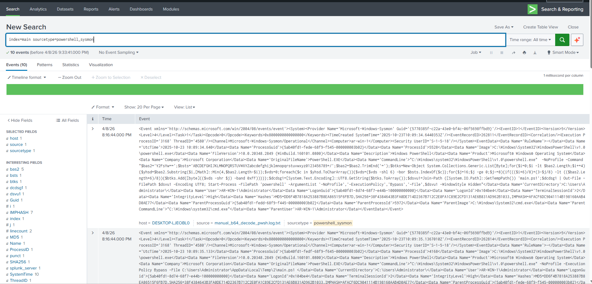
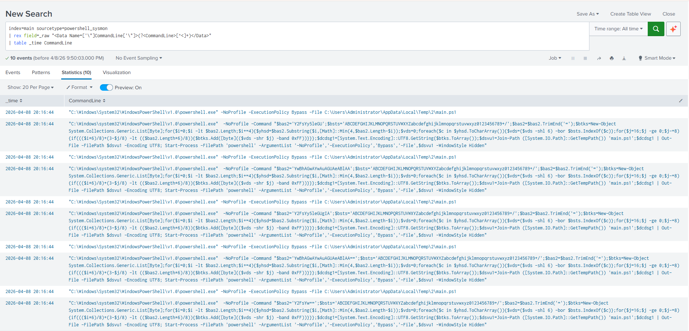
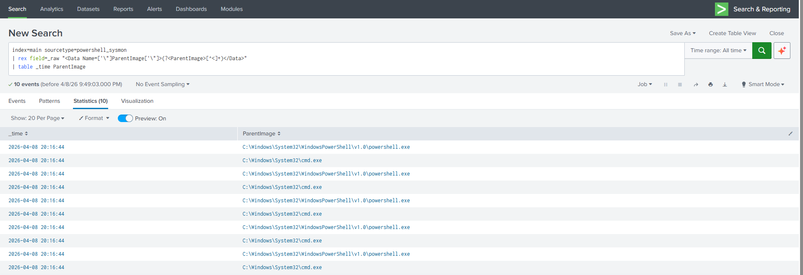
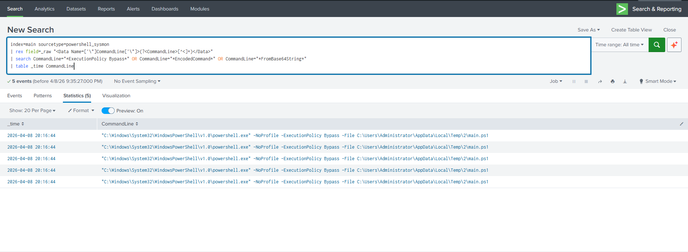
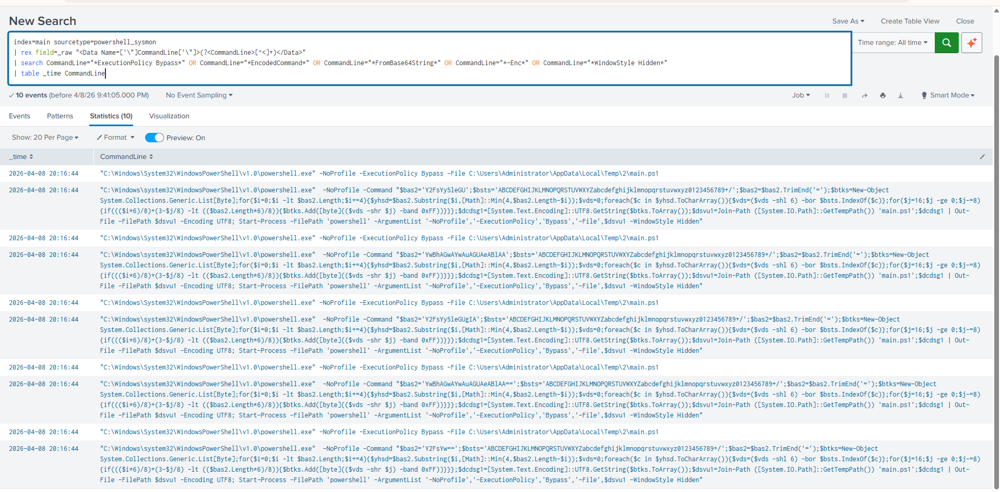
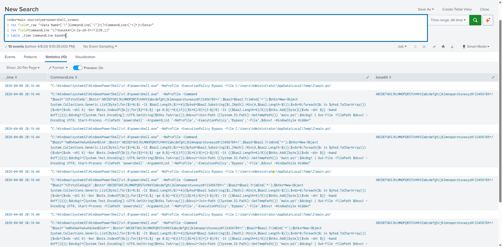
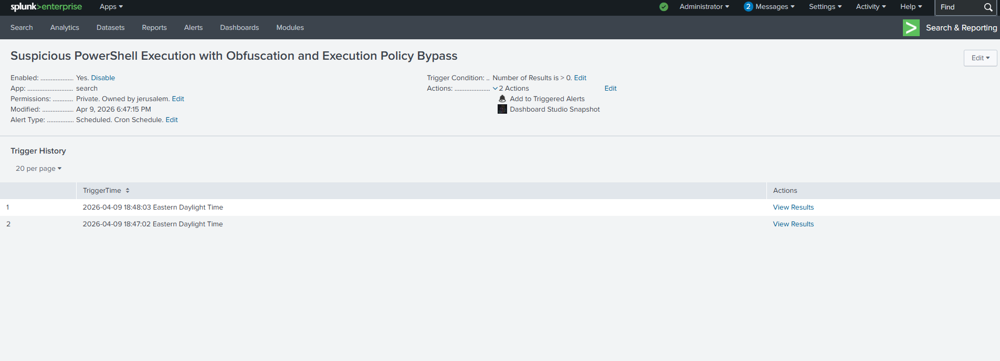

# Detecting Malicious PowerShell Activity in Splunk

---

## Overview  

This project focuses on detecting malicious PowerShell activity in a Splunk environment by analyzing Sysmon process creation events and PowerShell execution logs. The goal is to identify attacker techniques commonly used for defense evasion, including execution policy bypass, encoded payloads, and obfuscated command execution.

By analyzing command-line behavior and process relationships, this project demonstrates how suspicious PowerShell activity can be detected early in a SOC environment before escalation or persistence occurs.

## Investigation Evidence  

### 1. PowerShell Sysmon Log Ingestion  
  

Confirmed that Sysmon PowerShell logs are successfully ingested into Splunk using the correct sourcetype. Verified that events are searchable and contain process and command-line data.

---

### 2. Extracting PowerShell Commands from Raw Logs  
  

Reviewed raw event logs to extract PowerShell command-line activity. Focused on identifying commands executed by `powershell.exe`.

---

### 3. Parent-Child Process Analysis  
  

Analyzed parent and child processes to understand how PowerShell was launched. Looked for unusual patterns such as command shells spawning PowerShell.

---

### 4. Execution Policy Bypass Detection  
  

Identified command-line flags like `-ExecutionPolicy Bypass`, which indicate attempts to run scripts without standard restrictions.

---

### 5. Obfuscated PowerShell Command Analysis  
  

Observed PowerShell commands with unusual or complex patterns that may indicate obfuscation used to hide intent.

---

### 6. Base64 Encoded Payload Detection  
  

Detected usage of encoded commands (e.g., '-EncodedCommand'), which are commonly used to conceal script content.

---

### 7. Correlating Suspicious PowerShell Behaviors  
  

Combined multiple indicators such as encoded commands, execution policy bypass, and process behavior to identify suspicious activity patterns.

---

### 8. Suspicious PowerShell Activity Alert  
  

Triggered an alert when multiple suspicious behaviors were detected together, highlighting potential malicious activity.

---

## Detection Logic Summary  

The detection focuses on identifying behavioral indicators commonly associated with malicious PowerShell activity.

Detection conditions include:

- Use of execution policy bypass to run restricted scripts  
- Presence of encoded or obfuscated command-line arguments  
- PowerShell execution with hidden window flags  
- Use of command-line techniques such as `EncodedCommand` or Base64 decoding  
- Suspicious parent-child process relationships (e.g., cmd spawning PowerShell)  

These behaviors reflect real-world attacker techniques used to evade detection and execute malicious payloads.

---

## Attack Scenario  

An attacker gains access to a system and uses PowerShell to execute malicious code while attempting to evade detection.

To remain undetected, the attacker:
- Uses execution policy bypass to run restricted scripts  
- Encodes payloads using Base64 to hide malicious content  
- Executes obfuscated commands to avoid detection  
- Launches PowerShell from unusual parent processes  
- Runs scripts in hidden windows to reduce visibility  

---

## Detection Focus  

- Execution policy bypass activity  
- Encoded and obfuscated PowerShell commands  
- Suspicious command-line patterns  
- Parent-child process anomalies  
- Behavioral correlation of multiple indicators  

---

## Data Source  

- Sysmon Logs (Process Creation Events)  
- PowerShell Execution Logs  

---

## Detection Approach  

The detection was developed to reflect how endpoint activity is analyzed in a real SOC environment:

1. Data Validation  
   Verified ingestion and structure of Sysmon logs  

2. Command-Line Extraction  
   Parsed command-line fields from raw event data  

3. Process Analysis  
   Investigated parent-child process relationships  

4. Behavior Identification  
   Detected execution policy bypass and encoded command usage  

5. Correlation  
   Combined multiple suspicious indicators into a single detection  

6. Alerting Logic  
   Triggered alerts when high-risk patterns were identified  

---

## Key Findings  

- PowerShell executed with execution policy bypass  
- Encoded payloads used to conceal malicious activity  
- Obfuscated commands identified within command-line arguments  
- Suspicious parent processes initiating PowerShell execution  

---

## Alerting & Use Case  

Configured Splunk alerts to detect malicious PowerShell behavior, enabling:

- Early detection of attacker activity  
- Faster investigation and triage  
- Improved visibility into endpoint threats  

---

## MITRE ATT&CK Mapping  

- T1059.001 – PowerShell  
- T1027 – Obfuscated/Encoded Commands  
- T1055 – Process Injection (related behavior patterns)  

---

## Technologies & Tools  

- Splunk (Search & Reporting)  
- Sysmon Logs  
- PowerShell Logging  
- SPL (Search Processing Language)  

---

## Skills Demonstrated  

- Threat Hunting  
- Detection Engineering  
- Endpoint Log Analysis  
- Behavioral Analytics  
- SIEM Alert Development  

---

## Why This Project Matters  

PowerShell is widely used in enterprise environments, making it a common target for attackers. Because it is trusted and often overlooked, malicious activity can blend in with normal operations.
This project demonstrates how behavioral detection techniques can identify suspicious activity that traditional signature-based detection may miss.

---

## Conclusion  

This project shows how PowerShell-based attacks can be detected using behavioral indicators and log analysis. By correlating multiple suspicious signals, security teams can identify attacker activity early and reduce the risk of compromise.

---

## Disclaimer  

This project was conducted in a controlled environment using simulated data for defensive security and detection engineering purposes.
